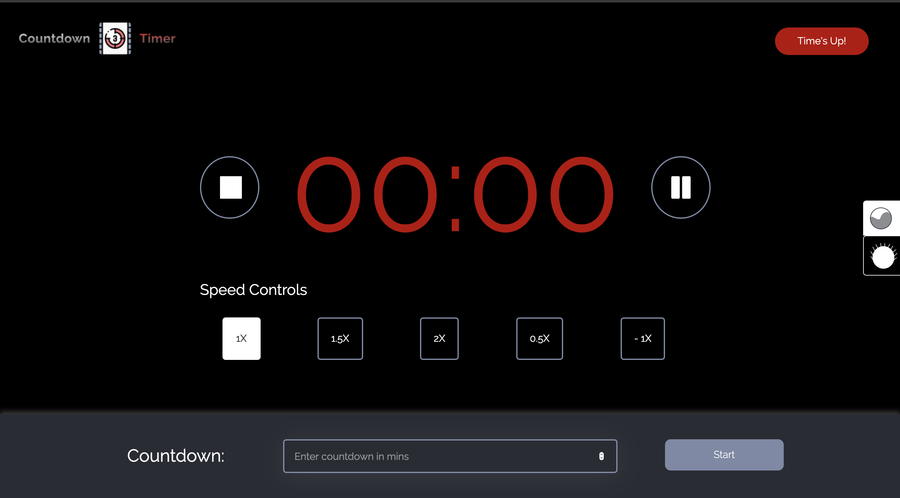
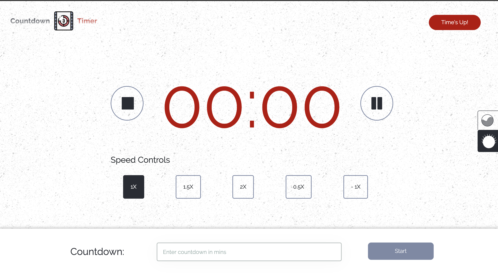
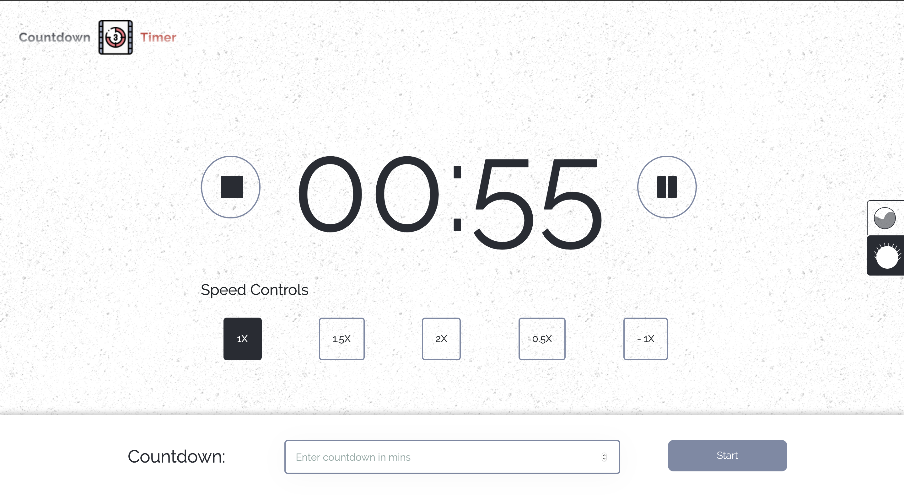
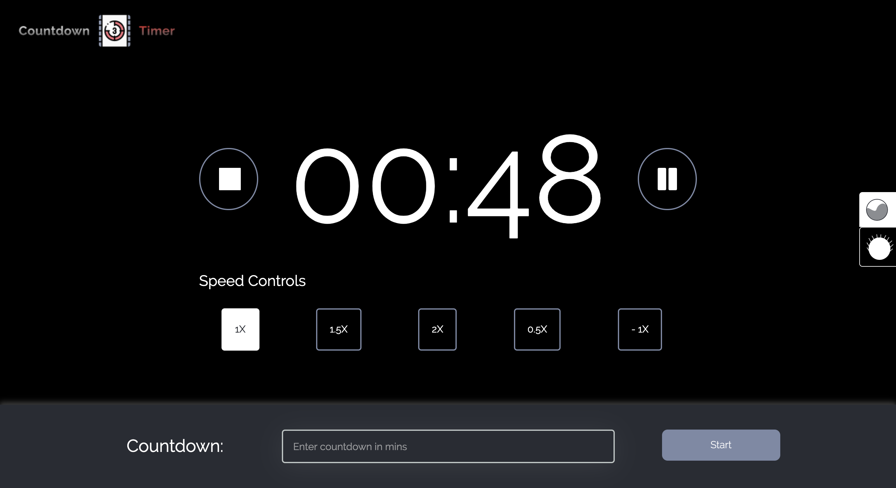
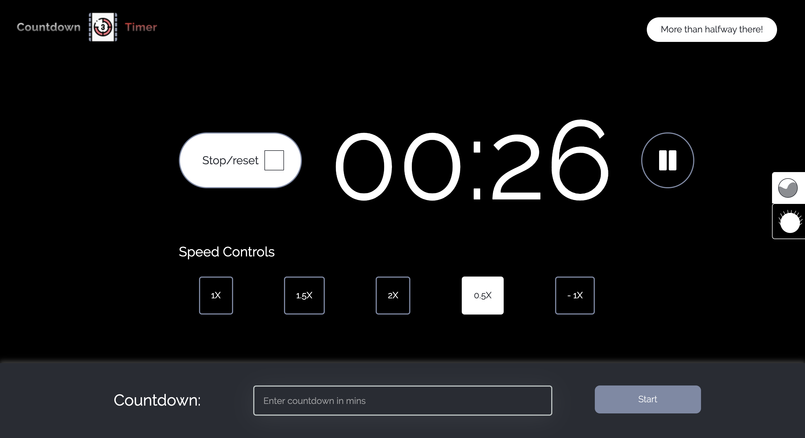
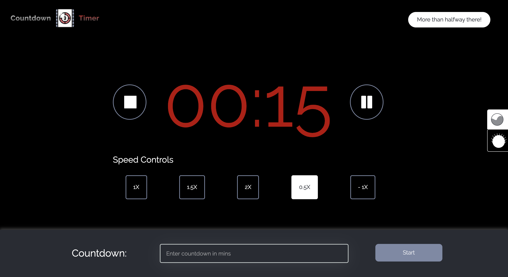
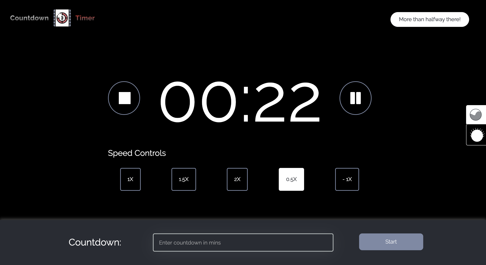
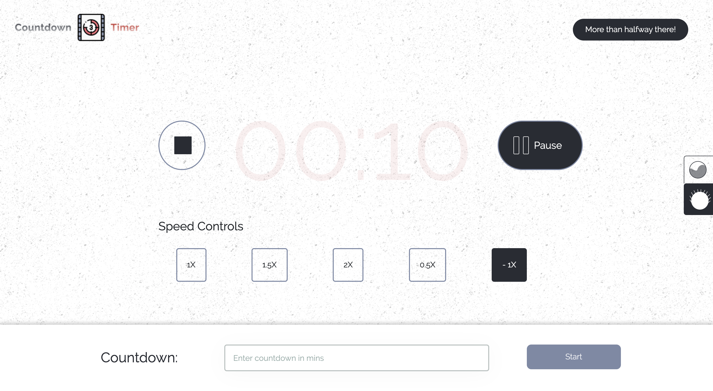
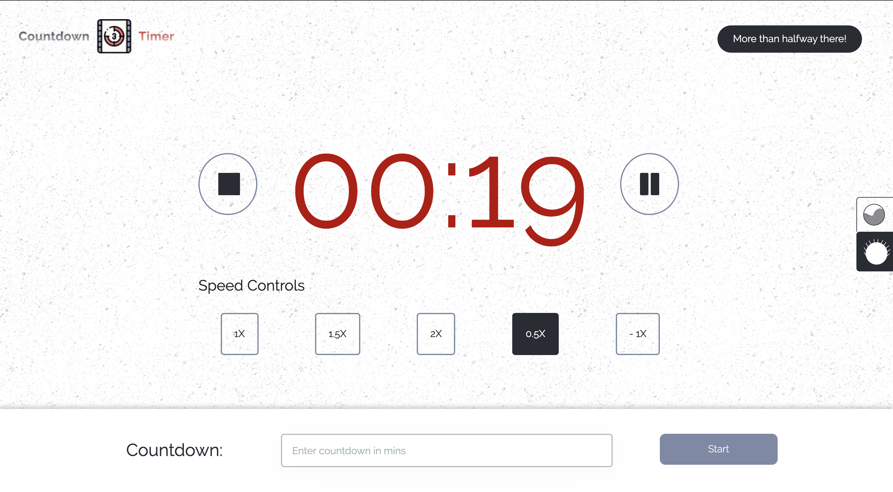

# Countdown Timer Application

## The Live Application

Test and play around with the production version of the application on [https://downtimer.netlify.app](https://downtimer.netlify.app)

## The Problem

Build a countdown timer in React Native with controls to add time, speed up / slow down the countdown, pause and resume.

## Requirements

- The user should be able to enter a # of minutes (positive integer) and click a “Start” button to initialize the countdown.
- Timer format: MM:SS
- The user should be able to pause & resume the countdown using pause/resume
  buttons.
- While the countdown timer is active, the user should be able to speed up / slow
  down the speed at the following rates: -- 1.0X (normal speed, selected by
  default) -- 1.5X -- 2X
- When half of the selected duration has been passed, display a string of text
  above the countdown timer reading: “More than halfway there!”
- When the countdown timer reaches 0, this text should change to: “Time’s up!”. When the countdown is within 20 seconds of ending, the countdown timer text
  should turn red.
- At 10 seconds, the text should start blinking.
- Include unit testing for applicable functionality.
- The countdown timer functionality should be appropriately divided into well-
  defined components.
- The look of the countdown timer should have a production-ready clean/modern
  aesthetic. Feel free to creatively stylize the elements.
- Extra credit: Play a sound as the timer ends.

## Approach & Solution

- Solution implemented using create-react-app
- Styling includes bootstrap and custom styles using sass & scss
- Style guide adopted is BEM
- Solution is broken down into 3 major components
  - `Counter:` receives minute and second props among others and displays count appropriately
  - `Controls:` triggers events that affect the counter such as pause or stop
  - `Speed Controls:` triggers events that affect the speed of the counter
- Dark theme mode is enabled through the use of props & localstorage
- All icons are custom built using figma, exported as svg and implemented as components in the icons folder
- Folders within the source folder includes:
  - `assets:` This holds all assets which may be images, sounds, css etc...
  - `Components:` This folder holds all stateless components and components that would be reused
  - `Containers:` This folder holds all stateful components and serve as pages
  - `Shared:` This folder holds all scripts that would be used across containers, components and the app in general
  - `Stylesheet:` This folder holds the 7-in-1 structure for implementing sass and scss
- Type checking is done using flow and is implemented across all components within the components folder
- Unit and integration tests is done using jest & enzyme

## Available Scripts

In the project directory, you can run:

### `npm start`

Runs the app in the development mode. 
Open [http://localhost:3000](http://localhost:3000) to view it in the browser.

The page will reload if you make edits. 
You will also see any lint errors in the console.

### `npm test`

Launches the test runner in the interactive watch mode. 
See the section about [running tests](https://facebook.github.io/create-react-app/docs/running-tests) for more information.

### `npm run build`

Builds the app for production to the `build` folder. 
It correctly bundles React in production mode and optimizes the build for the best performance.

The build is minified and the filenames include the hashes. 
Your app is ready to be deployed!

See the section about [deployment](https://facebook.github.io/create-react-app/docs/deployment) for more information.

### `npm run flow`

This invokes typechecking using flow and it check all files with `//@flow` at the beginning of the file and ensures all props passed are of the defined type as well as for state. 
see [flow docs](https://flow.org/en/docs/) for more information.

## Screenshots

    
    
    
    
    
    
    
    
  
